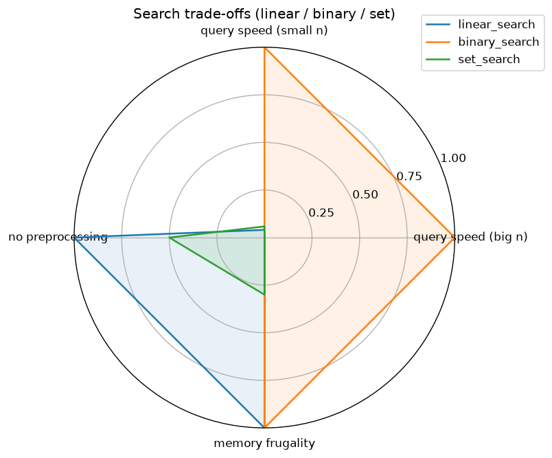

# 6/18 搜尋效能五階段實驗（1114405036 洪宇）

依 [`../../in_class/0618-search-lab.md`](../../in_class/0618-search-lab.md) 的五階段流程完成，
每階段都走 Read spec → red(`test:`) → green(`feat:`) → push，`git log --reverse`
可看到 test → feat 的交出順序。

## 檔案

```
timing.py     test_timing.py     # Stage 1：timeit 計時裝飾器
search.py     test_search.py     # Stage 2：linear / binary / set 三搜
benchmark.py  results.json       # Stage 2/3：量測 + baseline + 交叉點
plot.py       test_plot.py       # Stage 4：雷達圖
assets/radar.png
test_security.py                 # Stage 5：安全性規則
README.md  AI_LOG.md  TEST_LOG.md
```

跑全部測試：`python -m unittest test_timing test_search test_plot test_security`（21 passed）。

## Stage 1 — `timeit`

帶 `repeat`（預設 3）的計時裝飾器：回傳值不變、`functools.wraps` 保留 metadata、
每次呼叫跑 `repeat` 次把耗時 append 到 `f.records`、`f.last_elapsed` 為本次平均。
`records` / `last_elapsed` 掛在 wrapper 上（不用全域變數），每個被裝飾函式各自獨立。
`repeat < 1` 用 `raise ValueError`（不是 `assert`，因為 `assert` 在 `python -O` 會被移除）。

## Stage 2 — 三種搜尋

| 函式 | 回傳 | 前提 | 複雜度 |
|------|------|------|--------|
| `linear_search` | index / -1 | 無 | O(n) |
| `binary_search` | index / -1 | data 已排序 | O(log n) |
| `set_search` | bool | 無 | 建表 O(n) + 查找平均 O(1) |

三者都不修改傳入的 data。三函式回傳型別不一致，測試用「迴圈 + `subTest`」共用一組
案例，並先把結果正規化成 `found: bool`（linear/binary 看 `index >= 0`，set 看 `bool`）再比對。

`binary_search` 收到未排序 data 的行為（自訂）：不偷偷排序、不檢查，前提被破壞時回傳值未定義；
呼叫端負責先排序——偷排會改動/複製資料，並把 O(log n) 悄悄變成 O(n log n)。

## Stage 3 — baseline 與交叉點

baseline：`builtin_in`（`target in data`，C 版線性）與 `bisect_search`（標準庫 `bisect`）。
本次未做 Cython（課堂限制），只在演算法層面對照。

量測條件：固定 seed 產生已排序無重複整數，每個 size 查 `queries=100` 次（一半存在、一半不存在），
`repeat=3` 取平均（本機實測，數值見 `results.json`）：

| n | linear | binary | set | builtin_in | bisect |
|---|--------|--------|-----|-----------|--------|
| 1000 | 0.0016 | 0.000065 | 0.0011 | 0.00061 | 0.000019 |
| 5000 | 0.0090 | 0.000093 | 0.0129 | 0.00325 | 0.000028 |
| 20000 | 0.0371 | 0.000106 | 0.0661 | 0.01282 | 0.000024 |
| 80000 | 0.1553 | 0.000172 | 0.2665 | 0.05632 | 0.000031 |

### 動手量之前的預測（Stage 3 docs commit）

- 三種搜尋按「多次查詢」速度，預排序名次猜：binary < bisect << set < builtin_in << linear（越左越快）。
- 交叉點猜：「先排序 + 之後全 binary」大概在**查約 10 次以上**才開始贏過「每次 linear」。

### 實測後的交叉點

用本機 `timeit` 跑出來（`sorted` 對「打散後」的資料計時，避免 Timsort 對已排序輸入的 O(n) 最佳情況低估成本）：

| n | sort 成本(s) | 回本所需查詢次數 q* |
|---|------------|------------------|
| 1000 | 0.000068 | ~4.4 |
| 5000 | 0.000462 | ~5.2 |
| 20000 | 0.002268 | ~6.1 |
| 80000 | 0.011674 | ~7.5 |

判斷：

1. **誰快？** 同一份已排序資料、查很多次時，`binary_search`（與 `bisect`）遠快於 linear；
   在 n=80000 約快 **900 倍以上**。`set_search` 因為**每次呼叫都重建 set（O(n)）**，反而比
   linear 還慢——它的優勢只有在「建一次 set、反覆查」時才存在，本作業的函式簽章每次帶 data，所以吃虧。
2. **「排序 + binary」划不划算？** 只查 **1 次不划算**（排序 O(n log n) 比單次 linear O(n) 還貴）。
   實測交叉點落在**約查 4～8 次**之間（n 越大、sort 成本越高，回本門檻越高）：超過這個次數，
   「先排序一次、之後每次 binary」的總成本就低於「每次 linear」。
3. 我的預測（>10 次）比實測（4～8 次）保守——因為我低估了 linear 單次掃描在大 n 的成本，
   也高估了排序相對成本。

## Stage 4 — 雷達圖



四個維度（皆正規化到 0–1，越外圈越好）：

- **query speed (big n)**：最大 n 的每次查詢速度
- **query speed (small n)**：最小 n 的查詢速度
- **no preprocessing**：不需前置處理（linear=1；binary 需先排序=0；set 每次重建表=0.5）
- **memory frugality**：記憶體精簡（linear/binary 原地=1；set 需額外 O(n)=0.3）

解讀：`binary_search` 在兩個速度維度幾乎滿格，但需要預排序；`linear_search` 速度差，
卻贏在「免前置 + 省記憶體」；`set_search` 在這個「每次重建」的用法下三項都不突出——
**沒有一招全贏**，要看「查幾次、資料是否已排序、記憶體是否吃緊」來選。

## Stage 5 — 安全自掃（OpenSSF Secure Coding Guide for Python）

挑 3 條**適用**本專案的條目，先寫紅測（`test_security.py`）再修正：

| OpenSSF 章節 / CWE | 檢查結果 | 處置 |
|---|---|---|
| 03 Numbers（CWE-20 輸入驗證） | `make_data` 原本對 float/bool 會丟出語意不清的 TypeError | 加明確 guard：非整數或負數 → `raise ValueError` |
| 04 Neutralization（CWE-502 反序列化） | 需要讀回 `results.json` | 新增 `load_results` 一律用 `json`，不用 pickle（pickle 反序列化會執行任意碼） |
| 05 Exception Handling（CWE-396 過廣例外） | 讀檔失敗的處理 | `load_results` 讓 `FileNotFoundError` 自然傳出，不用 bare except 吞掉 |

掃到但**判定不用改**的項目：

- `benchmark.py` 用 `random` 產測試資料——這是可重現的效能量測，不是密碼學用途，
  **不需**改成 `secrets`（08/盲目替換反而是誤判）。
- 檔案 I/O 都已用 `with`（context manager），PNG 由 matplotlib 內部管理，無資源洩漏。

## 課堂自檢回答

1. `records`/`last_elapsed` 掛在 wrapper 上，讓每個被裝飾函式各自獨立計時，避免全域狀態污染。
2. 三搜共用測試時不能「一視同仁」直接比回傳值，因為 index 與 bool 語意不同，要先正規化成「是否找到」。
3. `binary_search` 收未排序 data：回傳值未定義、不偷排序，前提交由呼叫端負責（docstring 寫明）。
4. 本機交叉點約查 4～8 次；當查詢次數超過此門檻、且資料可重複使用時，「排序 + binary」才划算。
5. 十個 commit 順序為每階段 test → feat；若出現「feat 先於 test」或「沒有 red」就會被判 AI 代寫。
6. 安全自掃判「適用」的依據：該風險在本專案真的存在（如外部讀檔、輸入邊界），而非情境不符（如 random 非密碼學用途）。
